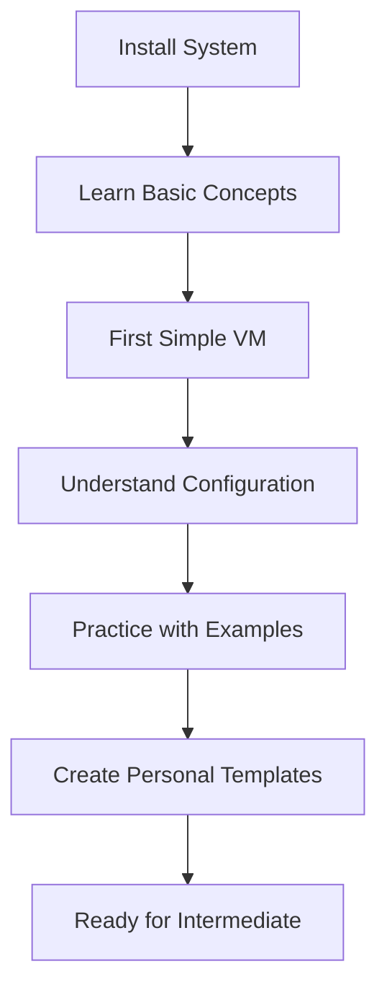
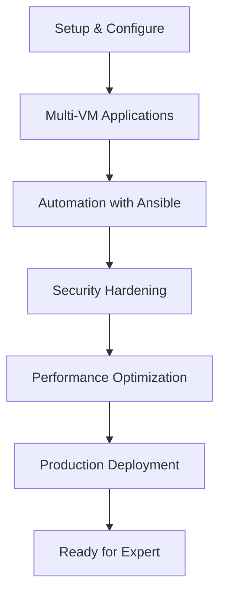
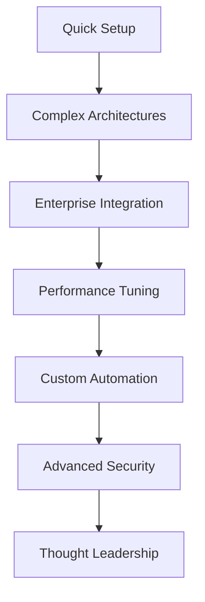

# 🗺️ User Journey Guide - Proxmox AI Infrastructure Assistant

## Overview

This guide optimizes the user experience for different personas and use cases, ensuring every user finds the most efficient path to success with the Proxmox AI Infrastructure Assistant.

## 🎯 User Personas & Optimal Paths

### 👶 Complete Beginner
**Profile**: New to infrastructure, virtualization, and automation  
**Goal**: Learn fundamentals while accomplishing basic tasks  
**Time Investment**: 2-4 weeks to become productive

#### Recommended Journey


#### Week-by-Week Plan

**Week 1: Foundation**
```bash
# Day 1-2: Setup and first success
curl -fsSL https://raw.githubusercontent.com/diszay/iac-ai-assistant/main/scripts/express-install.sh | bash
proxmox-ai config set ai.skill_level beginner
proxmox-ai chat
# Ask: "I'm completely new to this. Where should I start?"

# Day 3-4: Learn by doing
proxmox-ai generate terraform "Simple Ubuntu server for learning" --skill beginner
proxmox-ai explain generated-config.tf --skill beginner

# Day 5-7: Practice and understanding
proxmox-ai workshop beginner
proxmox-ai tutorial "first-vm"
proxmox-ai ask "What's the difference between memory and storage?"
```

**Week 2: Building Confidence**
```bash
# Try different VM types
proxmox-ai generate terraform "Web server with nginx" --skill beginner
proxmox-ai generate terraform "Database server" --skill beginner
proxmox-ai generate terraform "Development environment" --skill beginner

# Learn to modify configurations
proxmox-ai ask "How do I increase memory in my VM?"
proxmox-ai ask "How do I add more storage?"
proxmox-ai ask "What networking options do I have?"
```

**Week 3-4: Independent Practice**
```bash
# Create your own projects
proxmox-ai generate terraform "Personal blog server" --skill beginner
proxmox-ai security-review my-config.tf --skill beginner
proxmox-ai optimize my-config.tf --skill beginner

# Graduate to intermediate
proxmox-ai ask "Am I ready for intermediate level?"
proxmox-ai config set ai.skill_level intermediate
```

#### Success Metrics
- [ ] Can generate basic VM configurations independently
- [ ] Understands memory, CPU, storage, and networking concepts
- [ ] Can explain what each section of a configuration does
- [ ] Knows how to ask for help effectively
- [ ] Has created at least 3 different VM configurations

---

### 🛠️ Intermediate User
**Profile**: Some infrastructure experience, wants production-ready solutions  
**Goal**: Build real-world applications and environments  
**Time Investment**: 1-2 weeks to become proficient

#### Recommended Journey


#### Fast-Track Plan

**Days 1-2: Setup and Assessment**
```bash
# Quick setup
curl -fsSL https://raw.githubusercontent.com/diszay/iac-ai-assistant/main/scripts/express-install.sh | bash
proxmox-ai config set ai.skill_level intermediate

# Assess current knowledge
proxmox-ai chat
# Ask: "I have some infrastructure experience. What can this system do for me?"

# Generate production-ready config
proxmox-ai generate terraform "3-tier web application with load balancer" --skill intermediate
```

**Days 3-5: Real-World Applications**
```bash
# Build complete environments
proxmox-ai generate terraform "Development environment with CI/CD" --skill intermediate
proxmox-ai generate ansible "Server hardening and security" --skill intermediate
proxmox-ai generate terraform "Monitoring stack with Prometheus" --skill intermediate

# Learn optimization
proxmox-ai optimize my-infrastructure.tf --skill intermediate
proxmox-ai security-review my-infrastructure.tf --skill intermediate
```

**Days 6-7: Production Readiness**
```bash
# Advanced topics
proxmox-ai generate terraform "High-availability web cluster" --skill intermediate
proxmox-ai ask "How do I implement backup and disaster recovery?"
proxmox-ai ask "What are the performance optimization best practices?"

# Test readiness for expert level
proxmox-ai ask "I want to tackle enterprise-level challenges. What should I learn next?"
proxmox-ai config set ai.skill_level expert
```

#### Success Metrics
- [ ] Can design multi-VM applications
- [ ] Understands security hardening practices
- [ ] Can create automation with Ansible
- [ ] Knows performance optimization techniques
- [ ] Has deployed a production-ready environment

---

### 🚀 Expert User
**Profile**: Experienced with infrastructure, wants advanced enterprise features  
**Goal**: Complex architectures, optimization, and enterprise integration  
**Time Investment**: 1-3 days to leverage advanced features

#### Recommended Journey


#### Expert Fast-Track

**Day 1: Advanced Setup and Architecture**
```bash
# Rapid setup
curl -fsSL https://raw.githubusercontent.com/diszay/iac-ai-assistant/main/scripts/express-install.sh | bash
proxmox-ai config set ai.skill_level expert

# Immediate complex challenges
proxmox-ai generate terraform "Enterprise Kubernetes cluster with HA, monitoring, and disaster recovery" --skill expert
proxmox-ai generate terraform "Multi-region infrastructure with replication" --skill expert

# Advanced analysis
proxmox-ai analyze existing-production-infrastructure/ --skill expert
proxmox-ai design-review complex-architecture.tf --skill expert
```

**Day 2-3: Enterprise Integration and Optimization**
```bash
# Enterprise patterns
proxmox-ai generate terraform "Microservices platform with service mesh" --skill expert
proxmox-ai generate terraform "Data platform with ETL and ML pipelines" --skill expert

# Performance and security
proxmox-ai optimize --focus performance production-cluster.tf --skill expert
proxmox-ai security-audit enterprise-infrastructure/ --skill expert

# Custom solutions
proxmox-ai ask "How do I integrate this with our existing enterprise monitoring?"
proxmox-ai ask "What are the best practices for multi-tenant environments?"
```

#### Success Metrics
- [ ] Can design enterprise-grade architectures
- [ ] Understands advanced security and compliance requirements
- [ ] Can optimize for performance and cost at scale
- [ ] Integrates with existing enterprise systems
- [ ] Creates reusable patterns and templates

---

## 🎯 Use Case Journeys

### Use Case 1: "I Need a Simple Web Server"

#### Beginner Path (15 minutes)
```bash
# Start conversation
proxmox-ai chat
# Say: "I need to create a simple web server for my personal blog"

# Follow AI guidance
# Generated suggestions will include step-by-step instructions
# Configuration will be heavily commented and explained

# Expected outcome: Working web server configuration with learning
```

#### Intermediate Path (5 minutes)
```bash
# Direct generation
proxmox-ai generate terraform "nginx web server with SSL, 4GB RAM, monitoring" --skill intermediate

# Quick review and deploy
proxmox-ai security-review web-server.tf
proxmox-ai vm create web-server.tf

# Expected outcome: Production-ready web server
```

#### Expert Path (2 minutes)
```bash
# Advanced requirements
proxmox-ai generate terraform "HA web cluster with auto-scaling, CDN integration, and monitoring" --skill expert

# Custom optimization
proxmox-ai optimize --focus performance web-cluster.tf

# Expected outcome: Enterprise-grade web infrastructure
```

### Use Case 2: "I Want to Learn Infrastructure Automation"

#### Complete Learning Journey (4 weeks)
```bash
# Week 1: Foundations
proxmox-ai config set ai.skill_level beginner
proxmox-ai workshop beginner
proxmox-ai tutorial "infrastructure-basics"

# Week 2: Hands-on Practice
proxmox-ai generate terraform "Learning environment" --skill beginner
proxmox-ai examples terraform --interactive
proxmox-ai ask "Explain each part of this configuration"

# Week 3: Real Projects
proxmox-ai config set ai.skill_level intermediate
proxmox-ai generate terraform "Personal lab environment" --skill intermediate
proxmox-ai generate ansible "Automate my lab setup" --skill intermediate

# Week 4: Advanced Topics
proxmox-ai config set ai.skill_level expert
proxmox-ai generate terraform "Complex multi-tier application" --skill expert
proxmox-ai ask "How do professionals manage large infrastructures?"
```

### Use Case 3: "I Need This for Production Right Now"

#### Emergency Production Path (30 minutes)
```bash
# Rapid deployment
proxmox-ai config set ai.skill_level intermediate
proxmox-ai generate terraform "Production web application with database, load balancer, and monitoring" --skill intermediate

# Security and optimization
proxmox-ai security-review production-app.tf
proxmox-ai optimize production-app.tf

# Deployment checklist
proxmox-ai ask "What should I check before deploying to production?"
proxmox-ai ask "How do I set up monitoring and alerting?"

# Deploy with confidence
proxmox-ai vm create production-app.tf
```

### Use Case 4: "I Want to Migrate from Manual Setup"

#### Migration Journey (1 week)
```bash
# Assessment phase
proxmox-ai chat
# Say: "I have manually configured VMs. How do I convert to Infrastructure as Code?"

# Documentation phase
proxmox-ai ask "How do I document my existing infrastructure?"
proxmox-ai generate terraform "Replicate existing setup: [describe current setup]"

# Migration phase
proxmox-ai ask "What's the safest way to migrate from manual to automated?"
proxmox-ai generate ansible "Migrate existing server configurations"

# Optimization phase
proxmox-ai optimize migrated-infrastructure.tf
proxmox-ai security-review migrated-infrastructure.tf
```

## 🚀 User Experience Optimizations

### Onboarding Experience

#### First 5 Minutes
```bash
# Immediate success experience
curl -fsSL https://install-script-url | bash  # One-command install
proxmox-ai chat  # Immediate AI interaction
# AI asks: "What would you like to accomplish today?"
```

#### First Hour
- Complete a simple VM deployment
- Understand basic concepts through AI explanations
- Have a working configuration to build upon
- Know where to find help and documentation

#### First Day
- Create multiple VM configurations
- Understand skill level progression
- Use troubleshooting resources effectively
- Feel confident to explore independently

### Accessibility Features

#### Multiple Learning Styles
```bash
# Visual learners
proxmox-ai generate terraform "web server" --output web.tf --explain --visual

# Auditory learners  
proxmox-ai chat  # Interactive conversation-based learning

# Kinesthetic learners
proxmox-ai workshop hands-on  # Interactive workshops with immediate feedback

# Reading/writing learners
proxmox-ai examples terraform --detailed  # Comprehensive written examples
```

#### Different Technical Backgrounds

**Network Engineers**
```bash
proxmox-ai config set ai.context "network_engineer"
proxmox-ai ask "How does VM networking relate to physical networking?"
proxmox-ai generate terraform "Network lab with VLANs and routing"
```

**Developers**
```bash
proxmox-ai config set ai.context "developer"  
proxmox-ai ask "How does this fit into CI/CD pipelines?"
proxmox-ai generate terraform "Development environment with version control"
```

**System Administrators**
```bash
proxmox-ai config set ai.context "sysadmin"
proxmox-ai ask "How does this integrate with existing monitoring?"
proxmox-ai generate terraform "Enterprise monitoring and logging setup"
```

### Progressive Disclosure

#### Skill Level Features

**Beginner Mode**
- Extensive explanations and context
- Safety warnings and confirmations
- Learning resources prominently displayed
- Simple, single-purpose configurations

**Intermediate Mode**
- Production-ready defaults
- Best practices integrated
- Performance considerations
- Multi-component solutions

**Expert Mode**
- Advanced optimization options
- Enterprise patterns
- Custom integration possibilities
- Complex architecture support

### Help and Support Integration

#### Contextual Help
```bash
# Command-specific help
proxmox-ai generate --help  # Shows examples and use cases
proxmox-ai vm create --help  # Shows prerequisites and troubleshooting

# Intelligent error messages
# Error: "Connection refused"
# Suggestion: "Run 'proxmox-ai doctor' to diagnose network issues"
# Quick fix: "Try 'proxmox-ai config test' to verify connection settings"
```

#### Proactive Support
```bash
# Health monitoring
proxmox-ai doctor  # Automatic issue detection and solutions

# Performance monitoring  
proxmox-ai performance-check  # Optimization suggestions

# Security monitoring
proxmox-ai security-scan  # Proactive security recommendations
```

## 📊 User Journey Metrics

### Success Indicators

#### Time to First Success
- **Beginner**: Working VM configuration in 15 minutes
- **Intermediate**: Production-ready application in 30 minutes  
- **Expert**: Complex architecture in 60 minutes

#### Learning Progression
- **Week 1**: Basic VM creation and understanding
- **Week 2**: Multi-VM applications and automation
- **Week 3**: Security hardening and optimization
- **Week 4**: Advanced patterns and enterprise features

#### User Satisfaction
- Clear understanding of next steps
- Confidence to solve problems independently
- Successful completion of intended use case
- Eagerness to explore advanced features

### Continuous Improvement

#### Feedback Collection
```bash
# Built-in feedback system
proxmox-ai feedback  # Quick satisfaction survey

# Usage analytics (privacy-preserving)
proxmox-ai config set analytics.enabled true  # Anonymous usage patterns

# Community feedback
proxmox-ai community-feedback  # Share experiences and suggestions
```

#### Documentation Updates
- Regular review of user journey completion rates
- Analysis of common stopping points and friction
- Updates based on community feedback and support requests
- A/B testing of different onboarding approaches

---

**Document Version**: 1.0  
**Last Updated**: 2025-07-30  
**User Journey Guide for**: Proxmox AI Infrastructure Assistant

This guide ensures every user finds their optimal path to success, regardless of their starting point or intended destination.